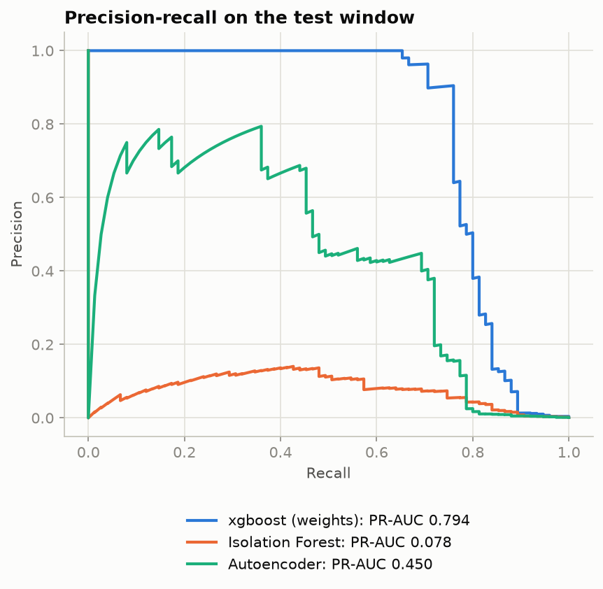
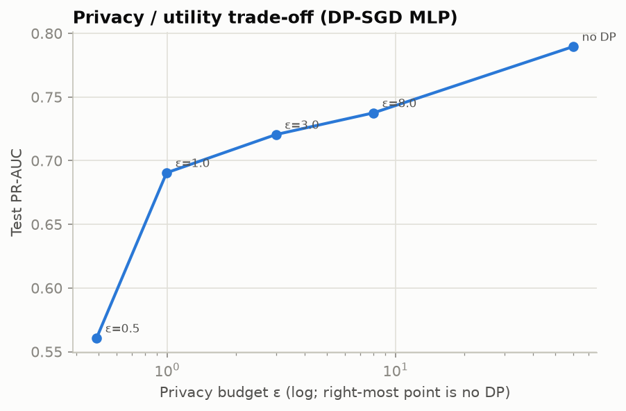
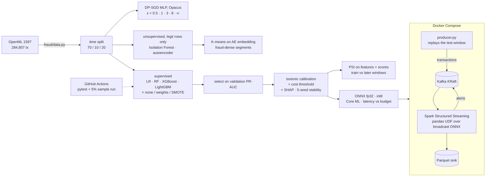
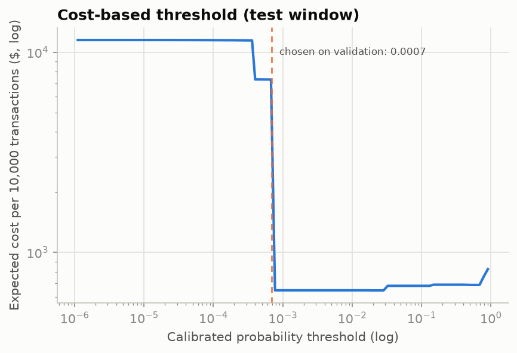
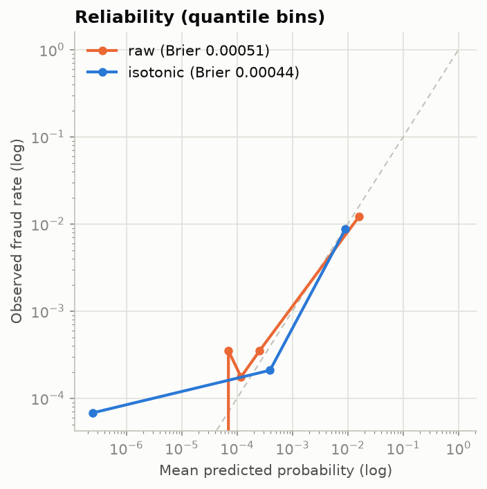
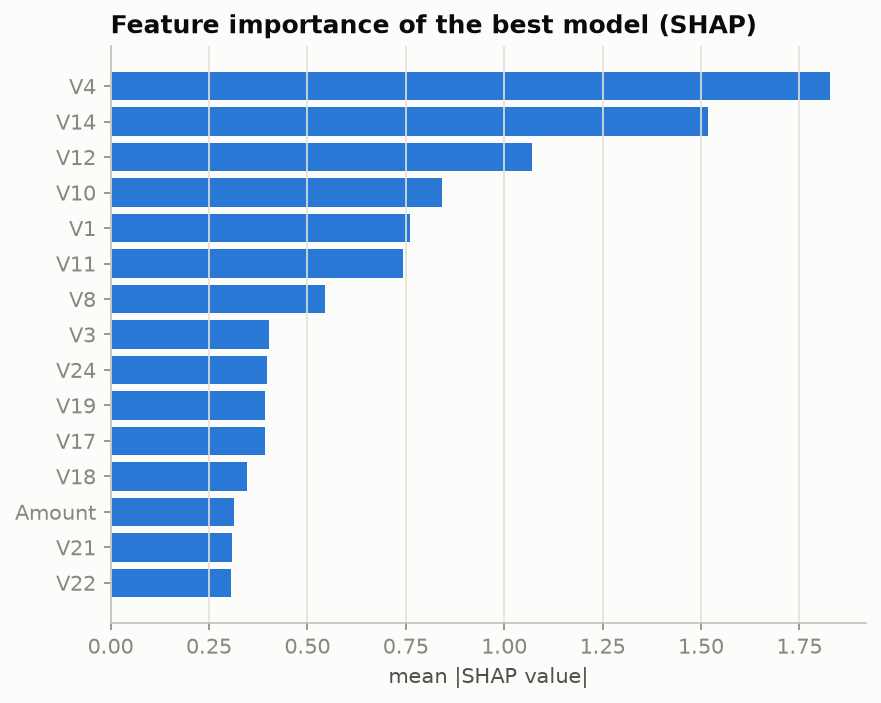

# Real-Time Fraud Detection

**Fraud detection on 284,807 real card transactions, done the way it has to be done in production: a
time-based split, metrics that survive a 0.17% positive rate, calibrated probabilities with a
cost-based threshold, unsupervised detectors for unlabelled fraud, differentially private training
with a measured privacy/utility curve, sub-millisecond ONNX and Core ML inference, a Kafka → Spark
Structured Streaming scoring path, and drift monitoring. Every number below is from a real run and
lives in `results/`.**

By **Simran Kharbanda**


| Precision-recall on the held-out time window | Privacy / utility trade-off |
|---|---|
|  |  |

| | |
|---|---|
| **Problem** | Card fraud is 1 transaction in 580. A model that never flags anything is 99.83% accurate and useless. Real systems need: no leakage from the future, metrics on the positive class, a threshold tied to money, probabilities that mean something, detectors for fraud nobody has labelled yet, and scoring that fits a latency budget in a stream. |
| **Data** | [OpenML 1597](https://www.openml.org/d/1597): 284,807 transactions by European cardholders over two days in September 2013, 492 frauds (0.172%). Public and **anonymised**: features V1–V28 are PCA components of confidential fields, plus Amount. Downloaded via the OpenML API, no login. |
| **Time split** | Rows are in chronological order, so the first 70% train (199,364 rows, 384 frauds), the next 10% validate (28,481 / 33), the last 20% test (56,962 / 75). Nothing is shuffled; thresholds, calibration, early stopping and model selection use validation only. |
| **Headline** | XGBoost with class weights (chosen on validation): test **PR-AUC 0.794**, ROC-AUC 0.979, **79% of frauds caught at a 0.1% false-positive rate**, 87% at 1%. The cost-based threshold cuts expected loss from **$2,633 to $824 per 10,000 transactions**. DP-SGD at ε = 1 keeps PR-AUC 0.69 (from 0.79). ONNX inference **p95 0.039 ms**, 250× inside a 10 ms budget. Streaming: {{STREAM_HEADLINE}}. |
| **Honesty notes** | The test window has only 75 frauds, so PR-AUC moves by ±0.03 across seeds (5-seed mean 0.775 ± 0.035). Rankings between the top models are within that noise. The dataset is small and two days long; drift numbers are day-to-day, not month-to-month. |

## Architecture



## Results

All on the test window (last 20% in time) unless stated. Hardware: MacBook Pro, Intel i7-9750H (6 cores), 16 GB.

### 1. Supervised baselines × imbalance strategy

Four models, three ways of handling the imbalance, each applied to the training window only.
Threshold = max-F1 on validation. `R@FPR` = recall at that false-positive rate.

| Model | Strategy | Val PR-AUC | **Test PR-AUC** | ROC-AUC | R@0.1% FPR | R@1% FPR | F1 | Fit |
|---|---|---|---|---|---|---|---|---|
| Logistic regression | none | 0.719 | 0.715 | 0.976 | 0.800 | 0.867 | 0.708 | 0.6 s |
| Logistic regression | class weights | 0.831 | 0.768 | 0.983 | 0.787 | 0.853 | 0.756 | 1.0 s |
| Logistic regression | SMOTE | 0.826 | 0.759 | 0.979 | 0.787 | 0.880 | 0.742 | 0.6 s |
| Random Forest | none | 0.838 | 0.797 | 0.987 | 0.800 | 0.880 | 0.824 | 76.5 s |
| Random Forest | class weights | 0.822 | 0.818 | 0.981 | **0.840** | 0.880 | **0.836** | 39.7 s |
| Random Forest | SMOTE | 0.828 | **0.827** | 0.985 | 0.813 | **0.893** | 0.790 | 70.3 s |
| **XGBoost** | none | 0.843 | 0.798 | 0.986 | 0.787 | 0.880 | 0.812 | 2.1 s |
| **XGBoost** | **class weights** | **0.843** | 0.794 | 0.979 | 0.787 | 0.867 | 0.791 | 5.1 s |
| XGBoost | SMOTE | 0.821 | 0.792 | 0.982 | 0.787 | 0.867 | 0.820 | 3.4 s |
| LightGBM | none | 0.713 | 0.758 | 0.903 | 0.773 | 0.800 | 0.753 | 0.8 s |
| LightGBM | class weights | 0.696 | 0.588 | 0.851 | 0.720 | 0.800 | 0.755 | 0.7 s |
| LightGBM | SMOTE | 0.828 | 0.799 | 0.982 | 0.787 | 0.867 | 0.803 | 1.2 s |

What it shows:
- **Selection is on validation, and validation and test disagree** (Random Forest + SMOTE is best on test, XGBoost is best on validation). That is exactly why the choice is made blind to test. XGBoost + class weights is the model used from here on: within noise of the best on test, 15× faster to train than the forest, and it exports cleanly.
- **Imbalance handling matters most for the weakest learner.** Class weights lift logistic regression by 11 points of validation PR-AUC. XGBoost is nearly indifferent (0.82–0.84). LightGBM with its defaults collapses on this positive rate (0.70–0.71) and only recovers with SMOTE (0.83): a reminder that the same algorithm family can behave very differently under extreme imbalance.
- At the chosen threshold (0.936) XGBoost flags 59 of 56,962 transactions: 53 frauds and 6 false alarms.

### 2. Unsupervised anomaly detection vs supervised

Both detectors train on **legitimate training rows only** and never see a label.

| Detector | PR-AUC | ROC-AUC | R@1% FPR | Fit |
|---|---|---|---|---|
| Isolation Forest (300 trees) | 0.078 | 0.956 | 0.653 | 3 s |
| Autoencoder (29-32-16-8, reconstruction error) | 0.451 | 0.941 | 0.787 | 28 s |
| XGBoost (supervised, for reference) | 0.794 | 0.979 | 0.867 | 5 s |

The autoencoder finds 79% of frauds at 1% FPR without any labels, which is the realistic starting
point for a *new* fraud pattern. Its precision is far lower than the supervised model's (PR-AUC
0.45 vs 0.79): labels are worth a lot. Isolation Forest ranks well globally (ROC 0.96) but its top
scores are dominated by legitimate outliers, so PR-AUC is poor.

### 3. Clustering: fraud-dense segments

K-means (k = 12) on the autoencoder's 8-d embedding, fit on train, reported on test:

| Cluster | Rows (test) | Frauds | Fraud rate | Lift vs base rate (0.13%) |
|---|---|---|---|---|
| 3 | 1,514 | 33 | 2.18% | **16.6×** |
| 8 | 68 | 1 | 1.47% | 11.2× |
| 7 | 1,008 | 8 | 0.79% | 6.0× |

One segment of 2.7% of transactions holds **44% of the frauds**. Used as a one-hot feature for
XGBoost, though, the cluster id *hurt*: validation PR-AUC 0.843 → 0.821, test 0.794 → 0.691. The
trees already carve out that region from the raw features, and the extra columns only add noise. So
the segments are useful for monitoring and analyst triage, not as model input. (Reported because
negative results are results.)

### 4. Calibration and the cost-based threshold

- **Isotonic calibration** (fit on validation) lowers the test Brier score from 0.000514 to
  0.000436 (−15%). It also lowers PR-AUC to 0.704, because isotonic regression maps many raw
  scores to the same value and destroys ordering inside each step. Use calibrated probabilities for
  decisions and money, raw scores for ranking.
- **Cost model:** a missed fraud costs $200 (roughly the mean fraudulent amount plus chargeback
  handling), a manual review $5. The threshold minimising expected cost on validation is a
  calibrated probability of **0.029**, far below 0.5, because a miss is 40× dearer than a review.
  On test it flags 135 transactions (60 frauds, 75 false alarms): **recall 0.80, precision 0.44**,
  expected cost **$824 per 10,000 transactions**, against $2,633 for flagging nothing and $50,000
  for reviewing everything.

 

### 5. Explainability and stability

- **SHAP** (TreeExplainer, 2,000 test rows): V4, V14, V12, V10, V1 and V11 carry most of the signal,
  in that order; V14 and V4 alone account for a third of the mean |SHAP|. 
- **5 seeds**, same model and strategy: test PR-AUC 0.794 · 0.788 · 0.798 · 0.786 · 0.706,
  **mean 0.775 ± 0.035**. One seed lands 9 points lower on the same data: with 75 positive test
  rows, a handful of ranking swaps moves the metric a lot. Any comparison finer than ±0.03 on this
  dataset is noise.

### 6. Privacy-preserving training

A 29-64-32-1 MLP trained with **DP-SGD** (Opacus, RDP accountant, per-example clipping at 1.0,
δ = 1/n_train = 5×10⁻⁶), 8 epochs, versus the identical MLP without DP.

| ε (spent) | Test PR-AUC | R@1% FPR | Noise multiplier |
|---|---|---|---|
| ∞ (no DP) | 0.790 | 0.893 | – |
| 8 | 0.738 | 0.773 | see `results/privacy.json` |
| 3 | 0.721 | 0.760 | |
| 1 | 0.691 | 0.747 | |
| 0.5 | 0.561 | 0.667 | |

ε = 1 (a strong guarantee) costs 10 points of PR-AUC; below that, utility falls off a cliff.

**What is protected, and what is not.** DP-SGD bounds how much any single training transaction
can influence the trained weights, which limits membership-inference and reconstruction attacks
against the model. It does not protect the test data, the raw data store, the features (already PCA-
anonymised by the data owner), or anything the deployed model is later queried with. It is one
control, not a privacy programme.

### 7. Inference efficiency vs a budget

Budget: **p95 ≤ 10 ms per single transaction on one CPU thread**. Batch-1 calls, 2,000 timed runs after warm-up.
Hardware: Intel i7-9750H, macOS 26.6.

| Artifact | Size | p50 | p95 | p99 | PR-AUC | Budget |
|---|---|---|---|---|---|---|
| XGBoost → ONNX fp32 | 432 KB | 0.029 ms | **0.039 ms** | | 0.794 | ✓ |
| MLP → ONNX fp32 | 17 KB | 0.024 ms | 0.044 ms | | 0.790 | ✓ |
| MLP → ONNX int8 (dynamic) | 9 KB | 0.032 ms | 0.075 ms | | 0.785 | ✓ |
| MLP → Core ML, CPU | 12 KB | 0.160 ms | 0.221 ms | | 0.795 (20k-row sample) | ✓ |
| MLP → Core ML, CPU + GPU | 12 KB | 0.361 ms | 1.19 ms | | | ✓ |

Every artifact is at least 8× inside the budget, and the two ONNX fp32 models are 250× inside it.
Two findings that matter for on-device work: **int8 halves the file but is slower** for a model
this small (the quantise/dequantise steps cost more than the 2,000 multiply-adds they save), and
the **GPU path is 5× slower** than CPU because per-call dispatch dominates a 30-feature MLP.
Quantisation and accelerators pay off at a size this model never reaches.

### 8. Real-time scoring: Kafka → Spark Structured Streaming

`streaming/` is a Docker Compose stack: Kafka 3.9 (KRaft) and Spark 3.5 with onnxruntime
installed. The producer replays the test window in time order into a `transactions` topic; the
Spark job scores each micro-batch with a **pandas UDF over the broadcast ONNX model**, writes every
scored event to a Parquet sink (with produce and score timestamps) and publishes events above the
cost threshold to an `alerts` topic.

{{STREAM_TABLE}}

### 9. Drift monitoring (PSI)

Population Stability Index of every feature and of the model score, training window vs later
windows, deciles from the training distribution (< 0.1 stable · 0.1–0.25 moderate · > 0.25 significant).

| Window | Score PSI | Features flagged (of 29) | Largest |
|---|---|---|---|
| validation | 0.014 (stable) | 14 | V1 0.93 · V3 0.78 · V28 0.54 |
| test, first half | 0.028 (stable) | 13 | V1 1.00 · V3 0.75 · V28 0.53 |
| test, second half | 0.050 (stable) | 14 | V1 1.00 · V3 0.76 · V28 0.53 |

Half of the inputs drift significantly (the two days differ), yet the score distribution barely
moves: the model leans on features that stayed stable (V4, V14, V12 are not flagged). This is the
distinction a monitor has to make. Feature drift is a warning to investigate; score drift is the
signal to act on. `results/drift.json` has the full report.

## Engineering notes

- **Reproducible:** `make all` regenerates every number; fixed seeds everywhere; `results/*.json` are
  committed so the README can be checked against them.
- **Tests (16, 6 s):** the time split cannot leak (train seq < val seq < test seq), metrics against
  hand-computed cases (recall at FPR, cost curve, Brier, reliability), and every model × strategy
  trains and scores.
- **CI:** pytest plus a full pipeline run on a 5% time-prefix sample on every push.
- **macOS gotchas, both documented in `fraud/__init__.py`:** XGBoost/LightGBM must be imported
  before PyTorch (the reverse order segfaults, two OpenMP runtimes), and PyTorch must run
  single-threaded once they are loaded (its training loop deadlocks otherwise). `libomp` was
  installed from a conda-forge package because Homebrew no longer ships Intel builds.
- **OpenML's copy has no `Time` column.** It is in the original chronological order (row 0 is the
  Kaggle file's first transaction), so the row position is the time axis and is not a feature.

## Limitations

- Two days of data, 75 test frauds. Every metric has wide error bars; the 5-seed spread is reported for that reason.
- PCA features cannot be interpreted; SHAP says *which* components matter, not *why*.
- The cost model's $200 / $5 are illustrative; the machinery accepts any pair.
- DP-SGD is applied to the MLP only; the tree models are not private.
- Streaming runs on one laptop in local-mode Spark; the numbers characterise the pipeline, not a cluster.

## Running it

```bash
make setup        # uv venv + requirements (Python 3.11)
make test         # 16 tests, no data download
make data         # OpenML download (150 MB) + split summary
make train        # 12 baselines           -> results/baselines.json
make evaluate     # anomaly, clustering, calibration, cost, SHAP, stability -> results/evaluation.json
make privacy      # DP-SGD curve            -> results/privacy.json
make onnx         # ONNX / int8 / Core ML   -> results/efficiency.json
make drift        # PSI report              -> results/drift.json
make all          # everything above (about 10 minutes)
make stream-up && make stream && make stream-down   # Kafka + Spark (Docker), -> results/streaming.json
```

## Layout

```
fraud/           data.py (split) · metrics.py · models.py · anomaly.py · clustering.py · privacy.py · export.py · drift.py · cli.py
streaming/       docker-compose.yml · spark.Dockerfile · jobs/score_stream.py · producer.py · run_experiment.py
tests/           test_split.py · test_metrics.py · test_models.py
results/         every number in this README; figures/ for the charts; artifacts/ (models, git-ignored)
```

## Author

**Simran Kharbanda**
